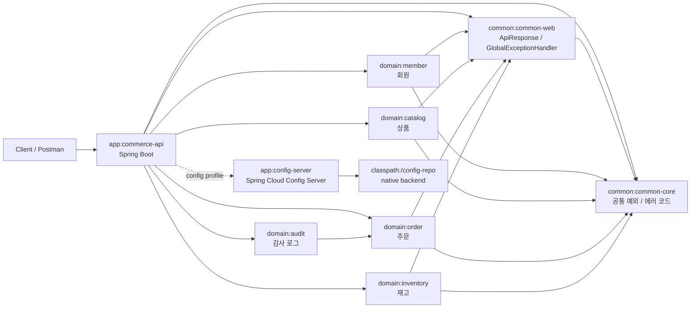
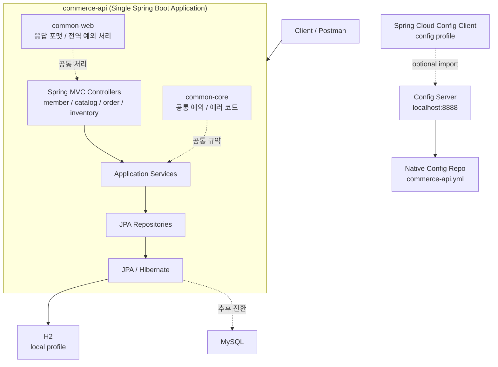

# Toy Commerce Platform

점진적으로 확장하는 학습용 커머스 백엔드 프로젝트입니다.

현재는 마이크로서비스가 아니라, 하나의 Spring Boot 애플리케이션 안에서 도메인 모듈을 분리한 형태의 멀티모듈 모놀리스 구조입니다. 이후 학습 단계에 따라 Redis, Kafka, Spring Cloud Config, Kubernetes, Istio, ELK, Prometheus, Thanos, Grafana, GoCD 등을 순차적으로 붙여 나가는 것을 목표로 합니다.

## 현재 구조

- `app/commerce-api`
  - 단일 실행 Spring Boot 애플리케이션
- `app/config-server`
  - Spring Cloud Config Server
  - 로컬 학습용 native backend로 `commerce-api` 외부 설정 제공
- `common/common-core`
  - 공통 예외, 에러 코드 같은 기본 규약
- `common/common-web`
  - API 응답 포맷, 전역 예외 처리
- `domain/member`
  - 회원 도메인
- `domain/catalog`
  - 상품 도메인
- `domain/order`
  - 주문 도메인
- `domain/inventory`
  - 재고 도메인
- `domain/audit`
  - MongoDB 기반 감사 로그 도메인

## 아키텍처 다이어그램

### 1. 모듈 구조



### 2. 실행 구조



### 3. 주문 이벤트 흐름

```mermaid
flowchart LR
    OrderService["OrderService<br/>주문 생성 / 취소"] --> EventPort["OrderEventPort<br/>이벤트 발행 포트"]
    EventPort --> SpringEventAdapter["SpringOrderEventPublisherAdapter<br/>Spring ApplicationEvent 발행"]
    SpringEventAdapter --> SpringEvent["Spring ApplicationEvent<br/>트랜잭션 커밋 후 처리"]
    SpringEvent --> KafkaListener["KafkaOrderEventListener<br/>dev profile"]
    KafkaListener --> Kafka["Kafka<br/>주문 이벤트 토픽"]
    Kafka --> KafkaConsumer["KafkaOrderEventConsumer<br/>주문 이벤트 구독"]
    KafkaConsumer --> AuditService["AuditLogService<br/>dev profile"]
    AuditService --> MongoDB["MongoDB<br/>audit_logs"]
```



현재 주문 도메인은 Kafka를 직접 알지 않도록 `OrderEventPort`에만 의존합니다. `commerce-api` 애플리케이션이 Spring 이벤트 발행 어댑터를 제공하고, `dev` 프로필이 활성화되면 `KafkaOrderEventListener`가 트랜잭션 커밋 이후 주문 이벤트를 Kafka 토픽으로 전달합니다. 같은 프로필에서 `KafkaOrderEventConsumer`가 주문 이벤트 토픽을 구독해 수신 로그를 남기고, MongoDB `audit_logs` 컬렉션에도 감사 로그를 저장합니다.

## 현재 기술 스택

- Java
- Gradle Multi Module
- Spring Boot
- Spring MVC
- Spring Data JPA / Hibernate
- H2
- MySQL
- Redis Cache
- Spring ApplicationEvent
- Kafka Producer
- Kafka Consumer
- Spring Cloud Config
- MongoDB

## 확장 방향

현재 코드는 Java 기반으로 구성했고, Gradle 스크립트는 Groovy DSL을 사용합니다. 처음에는 `commerce-api` 하나만 실행하고, 도메인 경계는 모듈로만 분리해 둡니다. 이후 학습 단계에 따라 아래 순서로 확장합니다.

1. MySQL, JPA 기반 CRUD 고도화
2. Redis 캐시와 재고 보조 처리
3. 주문 이벤트 발행 포트와 Spring ApplicationEvent 기반 확장 지점
4. Kafka 주문 이벤트 발행
5. Kafka 이벤트 구독
6. Spring Cloud Config 기반 설정 외부화
7. MongoDB 감사 로그
8. Oracle 레거시 정산 연동
9. Docker, Kubernetes, Istio
10. ELK, Prometheus, Thanos, Grafana
11. GoCD 파이프라인

## 프로필 전략

이 프로젝트의 Spring profile은 환경 중심으로 단순화합니다. 기능별 조합을 모두 profile group으로 만들지 않고, 자주 쓰는 환경 단위만 제공합니다.

- `local`: 개발자 PC 기본 실행 환경입니다. H2 인메모리 DB와 simple cache를 사용하고, 외부 Redis health check는 비활성화합니다.
- `dev`: 개발 서버 또는 Docker Compose 기반 통합 실행 환경입니다. MySQL, Redis, Kafka, MongoDB 설정을 한 번에 사용합니다.
- `config`: Spring Cloud Config Server에서 외부 설정을 optional로 가져오는 토글 프로필입니다.

자주 쓰는 Config Server 조합은 profile group으로 제공합니다.

- `local-config` = `local` + `config`
- `dev-config` = `dev` + `config`

설정 파일은 아래 기준으로 관리합니다.

- `application.yml`: 공통 설정, 기본 프로필, profile group
- `application-local.yml`: 로컬 PC용 H2, simple cache 설정
- `application-dev.yml`: 개발 환경용 MySQL, Redis, Kafka, MongoDB 설정
- `application-config.yml`: Spring Cloud Config Client 설정

## 권장 다음 작업

1. `./gradlew test` 또는 `gradlew.bat test`로 기본 빌드 확인
2. Oracle 레거시 정산 연동 흐름 추가
3. Config Server backend를 native에서 Git 저장소로 전환
4. MongoDB 감사 로그 조회 API 추가

## 로컬 실행

아무 프로필도 지정하지 않으면 `local` 프로필이 기본으로 적용됩니다. 이 경우 H2와 simple cache를 사용합니다.

```powershell
.\gradlew.bat :app:commerce-api:bootRun
```

Docker Compose로 개발용 인프라를 실행한 뒤 `dev` 프로필로 애플리케이션을 실행할 수 있습니다.

```powershell
docker compose up -d mysql redis kafka mongo
```

```powershell
.\gradlew.bat :app:commerce-api:bootRun --args='--spring.profiles.active=dev'
```

`dev` 프로필은 MySQL, Redis, Kafka, MongoDB 설정을 함께 사용합니다. Kafka 토픽 이름은 `application-dev.yml`에 정의되어 있습니다.

- `toy-commerce.order.created`
- `toy-commerce.order.cancelled`

Kafka 주문 이벤트가 수신되면 MongoDB `audit_logs` 컬렉션에 감사 로그가 저장됩니다.

Spring Cloud Config를 확인하려면 먼저 Config Server를 실행합니다.

```powershell
.\gradlew.bat :app:config-server:bootRun
```

다른 터미널에서 `config` 프로필을 함께 활성화해 `commerce-api`를 실행합니다.

```powershell
.\gradlew.bat :app:commerce-api:bootRun --args='--spring.profiles.active=local-config'
```

개발 인프라와 Config Server를 함께 사용할 때는 `dev-config` profile group을 사용합니다.

```powershell
.\gradlew.bat :app:commerce-api:bootRun --args='--spring.profiles.active=dev-config'
```

Config Server에서 받은 설정은 아래 API로 확인할 수 있습니다.

```powershell
curl http://localhost:8080/api/v1/config
```

기본 접속 정보는 `.env.example`에 정리되어 있습니다. 개인 환경에서 값을 바꾸고 싶다면 `.env` 파일을 만들어 Docker Compose 환경 변수로 사용하면 됩니다.
