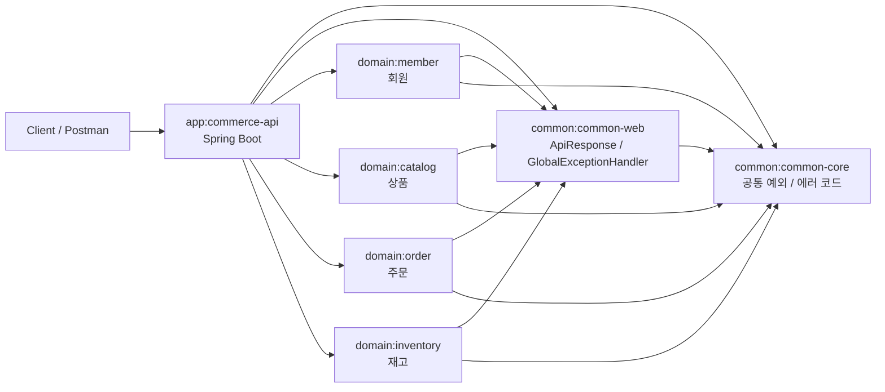
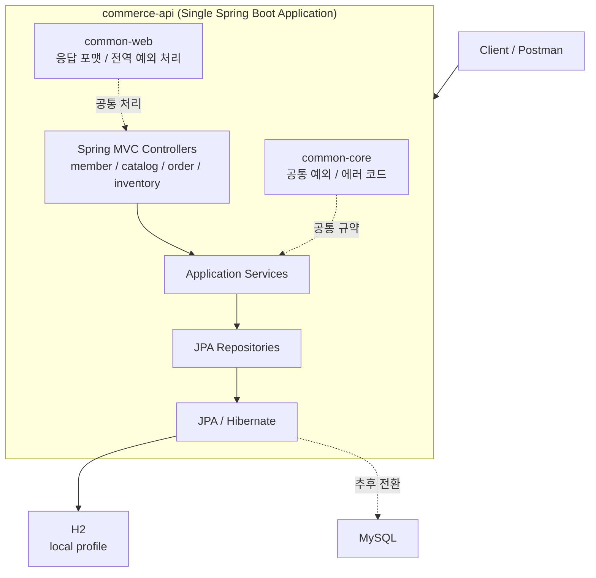

# Toy Commerce Platform

점진적으로 확장하는 학습용 커머스 백엔드 프로젝트입니다.

현재는 마이크로서비스가 아니라, 하나의 Spring Boot 애플리케이션 안에서 도메인 모듈을 분리한 형태의 멀티모듈 모놀리스 구조입니다. 이후 학습 단계에 따라 Redis, Kafka, Spring Cloud Config, Kubernetes, Istio, ELK, Prometheus, Thanos, Grafana, GoCD 등을 순차적으로 붙여 나가는 것을 목표로 합니다.

## 현재 구조

- `app/commerce-api`
  - 단일 실행 Spring Boot 애플리케이션
- `common/common-core`
  - 공통 예외, 에러 코드 같은 기본 규약
- `common/common-web`
  - API 응답 포맷, 전역 예외 처리
- `domain/member`
  - 회원 도메인
- `domain/catalog`
  - 상품 도메인
- `domain/order`
  - 주문 도메인
- `domain/inventory`
  - 재고 도메인

## 아키텍처 다이어그램

### 1. 모듈 구조

### 2. 실행 구조

## 현재 기술 스택

- Java
- Gradle Multi Module
- Spring Boot
- Spring MVC
- Spring Data JPA / Hibernate
- H2
- MySQL 예정

## 확장 방향

현재 코드는 Java 기반으로 구성했고, Gradle 스크립트는 Groovy DSL을 사용합니다. 처음에는 `commerce-api` 하나만 실행하고, 도메인 경계는 모듈로만 분리해 둡니다. 이후 학습 단계에 따라 아래 순서로 확장합니다.

1. MySQL, JPA 기반 CRUD 고도화
2. Redis 캐시와 재고 보조 처리
3. Spring Cloud Config
4. Kafka 이벤트 발행과 구독
5. MongoDB 감사 로그
6. Oracle 레거시 정산 연동
7. Docker, Kubernetes, Istio
8. ELK, Prometheus, Thanos, Grafana
9. GoCD 파이프라인

## 권장 다음 작업

1. `./gradlew test` 또는 `gradlew.bat test`로 기본 빌드 확인
2. `member`, `catalog`부터 실제 CRUD 확장
3. `local`, `dev`, `prod` 설정 분리
4. MySQL 프로필과 Docker Compose 추가
