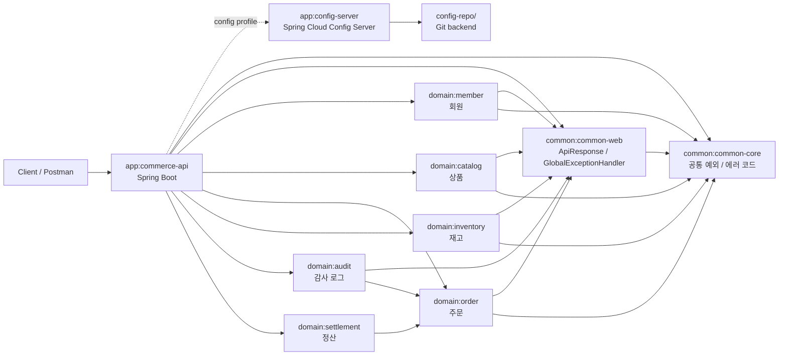
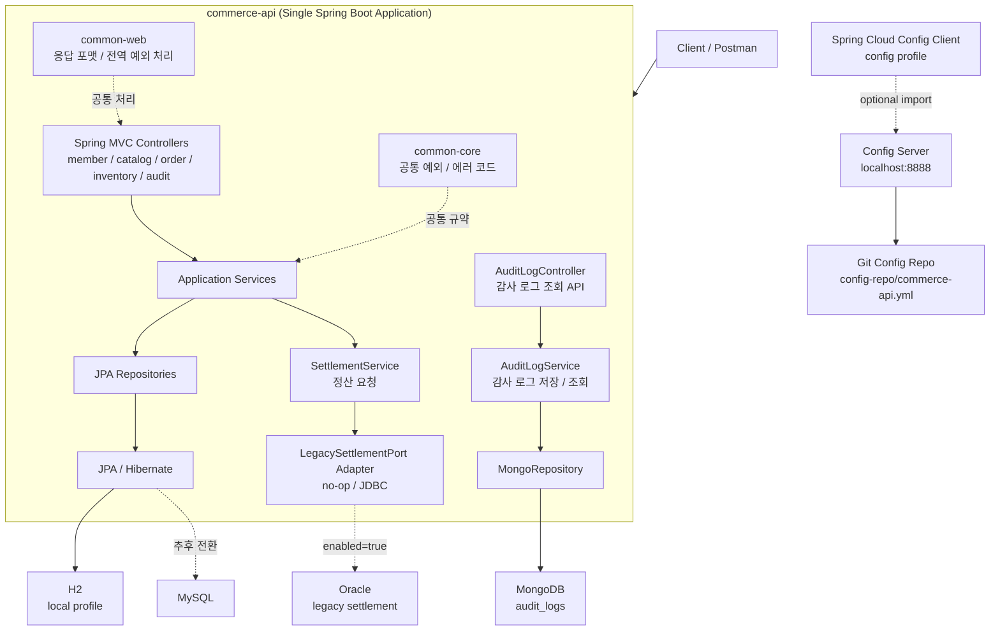
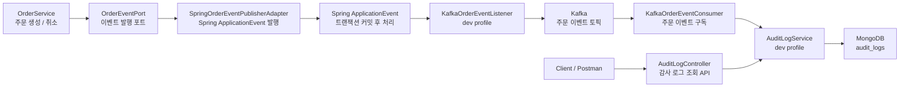
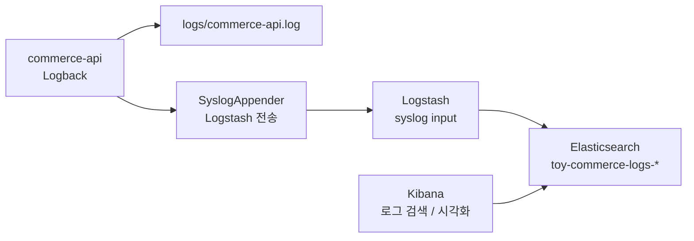
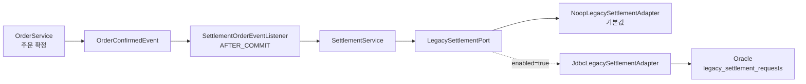
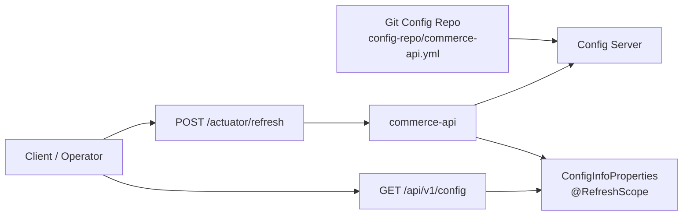

# Toy Commerce Platform

점진적으로 확장하는 학습용 커머스 백엔드 프로젝트입니다.

현재는 마이크로서비스가 아니라, 하나의 Spring Boot 애플리케이션 안에서 도메인 모듈을 분리한 형태의 멀티모듈 모놀리스 구조입니다. 이후 학습 단계에 따라 Redis, Kafka, Spring Cloud Config, Kubernetes, Istio, ELK, Prometheus, Thanos, Grafana, GoCD 등을 순차적으로 붙여 나가는 것을 목표로 합니다.

## 학습 목표와 진행 방향

이 프로젝트는 기술을 한 번에 모두 붙이는 것이 아니라, 커머스 도메인의 실제 흐름에 맞춰 필요한 기술을 하나씩 적용해보는 것을 목표로 합니다. 처음부터 마이크로서비스로 분리하지 않고, 단일 Spring Boot 애플리케이션 안에서 도메인 모듈을 나누어 도메인 경계와 의존성 방향을 먼저 익힙니다.

현재는 Java 기반으로 학습을 진행합니다. Kotlin은 당장 함께 도입하기보다, Java와 Spring 생태계의 기본 흐름이 충분히 익숙해진 뒤 필요하다고 판단되면 다시 적용합니다.

학습 원칙은 아래와 같습니다.

- 새 기술은 단순 설치가 아니라 실제 유스케이스에 연결합니다.
- 기능을 추가할 때는 가능한 한 테스트 코드를 함께 작성합니다.
- 로컬 개발, 외부 인프라 연동, 운영 관찰 가능성 순서로 확장합니다.
- 실무 상황을 가정하되, 학습 순서를 해치지 않도록 한 단계씩 진행합니다.

## 학습 진행 현황

| 단계 | 학습 주제 | 현재 적용 방식 | 상태 |
| --- | --- | --- | --- |
| 1 | Java, Gradle, Spring Boot, Spring MVC | Gradle 멀티모듈과 `commerce-api` 단일 실행 애플리케이션 | 완료 |
| 2 | JPA / Hibernate, H2, MySQL | local은 H2, dev는 MySQL 설정으로 CRUD 흐름 구성 | 완료 |
| 3 | Redis | 상품 조회 캐시와 dev Redis 설정 적용 | 완료 |
| 4 | Kafka | 주문 이벤트 발행 / 구독 흐름 구성 | 완료 |
| 5 | MongoDB | Kafka 주문 이벤트 수신 후 감사 로그 저장 / 조회 API 구성 | 완료 |
| 6 | Spring Cloud Config | Config Server, Git backend, 수동 refresh 흐름 구성 | 완료 |
| 7 | ELK | Logback, Logstash, Elasticsearch, Kibana 기반 로그 수집 흐름 구성 | 완료 |
| 8 | Oracle | 주문 확정 후 레거시 정산 연동 어댑터 구성 | 완료 |
| 9 | Prometheus, Grafana | 애플리케이션 메트릭 수집과 시각화 | 다음 단계 |
| 10 | Docker, Kubernetes, Istio | 애플리케이션 컨테이너화와 배포 / 트래픽 관리 | 예정 |
| 11 | Thanos | Prometheus 장기 저장 / 확장 구조 학습 | 예정 |
| 12 | GoCD | 배포 파이프라인 구성 | 예정 |

## 현재 구조

- `app/commerce-api`
  - 단일 실행 Spring Boot 애플리케이션
- `app/config-server`
  - Spring Cloud Config Server
  - Git backend로 `commerce-api` 외부 설정 제공
- `common/common-core`
  - 공통 예외, 에러 코드 같은 기본 규약
- `common/common-web`
  - API 응답 포맷, 전역 예외 처리
- `domain/member`
  - 회원 도메인
- `domain/catalog`
  - 상품 도메인
- `domain/order`
  - 주문 도메인
- `domain/inventory`
  - 재고 도메인
- `domain/audit`
  - MongoDB 기반 감사 로그 도메인
- `domain/settlement`
  - 레거시 정산 연동 도메인

## 아키텍처 다이어그램

### 1. 모듈 구조



### 2. 실행 구조



### 3. 주문 이벤트 흐름



현재 주문 도메인은 Kafka를 직접 알지 않도록 `OrderEventPort`에만 의존합니다. `commerce-api` 애플리케이션이 Spring 이벤트 발행 어댑터를 제공하고, `dev` 프로필이 활성화되면 `KafkaOrderEventListener`가 트랜잭션 커밋 이후 주문 이벤트를 Kafka 토픽으로 전달합니다. 같은 프로필에서 `KafkaOrderEventConsumer`가 주문 이벤트 토픽을 구독해 수신 로그를 남기고, MongoDB `audit_logs` 컬렉션에도 감사 로그를 저장합니다. 저장된 감사 로그는 `AuditLogController`의 `GET /api/v1/audit-logs` API로 조회할 수 있습니다.

주문 생성 API는 `memberId`, `productId`, `quantity`만 입력받습니다. `totalPrice`는 클라이언트 요청값을 신뢰하지 않고, `OrderService`가 `ProductPort`를 통해 조회한 상품 가격과 주문 수량으로 계산합니다.

재고 차감은 `quantity >= 요청 수량` 조건을 포함한 update 쿼리로 처리합니다. DB가 한 문장 안에서 재고 충분 여부와 차감을 원자적으로 처리하므로, 높은 동시 접근에서도 초과 차감을 방지하면서 행 락 대기 시간을 줄일 수 있습니다.

### 4. 로그 수집 흐름



`dev` 프로필에서는 Logback이 콘솔과 파일에 로그를 남기고, Syslog appender를 통해 Logstash로도 로그를 전송합니다. Logstash는 수신한 로그에 `service.name=commerce-api` 필드를 붙여 Elasticsearch의 `toy-commerce-logs-*` 인덱스로 저장하고, Kibana에서 조회합니다.

### 5. 레거시 정산 연동 흐름



주문이 `CONFIRMED` 상태로 전환되면 `OrderConfirmedEvent`를 발행합니다. 트랜잭션 커밋 이후 `SettlementOrderEventListener`가 이벤트를 받아 정산 서비스를 호출하고, 기본값에서는 no-op 어댑터가 동작합니다. `toy-commerce.settlement.legacy.enabled=true`로 켜면 JDBC 어댑터가 별도 레거시 DataSource를 사용해 Oracle 정산 테이블로 요청을 전달합니다.

### 6. 설정 refresh 흐름



`commerce-api`는 시작 시점에 Config Server에서 설정을 읽습니다. 실행 중 Git 설정이 바뀐 경우에는 `config` 프로필에서 노출되는 `/actuator/refresh`를 호출해야 `@RefreshScope`가 적용된 설정 Bean이 새 값으로 갱신됩니다. 현재 프로젝트에서는 `ConfigInfoProperties`가 refresh 대상입니다.

## 현재 기술 스택

- Java
- Gradle Multi Module
- Spring Boot
- Spring MVC
- Spring Data JPA / Hibernate
- H2
- MySQL
- Oracle
- Redis Cache
- Spring ApplicationEvent
- Kafka Producer
- Kafka Consumer
- Spring Cloud Config
- MongoDB
- ELK
- Docker Compose

## 확장 방향

현재 코드는 Java 기반으로 구성했고, Gradle 스크립트는 Groovy DSL을 사용합니다. 처음에는 `commerce-api` 하나만 실행하고, 도메인 경계는 모듈로만 분리해 둡니다. 이후 학습 단계에 따라 아래 순서로 확장합니다. 이미 완료한 항목도 이후 리팩토링이나 운영 관점 학습에서 다시 다룰 수 있습니다.

1. MySQL, JPA 기반 CRUD 고도화
2. Redis 캐시와 재고 보조 처리
3. 주문 이벤트 발행 포트와 Spring ApplicationEvent 기반 확장 지점
4. Kafka 주문 이벤트 발행
5. Kafka 이벤트 구독
6. Spring Cloud Config 기반 설정 외부화
7. MongoDB 감사 로그 저장
8. MongoDB 감사 로그 조회 API
9. ELK 기반 애플리케이션 로그 수집
10. Oracle 레거시 정산 연동
11. Prometheus와 Grafana 기반 메트릭 시각화
12. Docker 이미지 빌드, Kubernetes, Istio
13. Thanos 기반 메트릭 장기 저장 / 확장
14. GoCD 파이프라인

## 프로필 전략

이 프로젝트의 Spring profile은 환경 중심으로 단순화합니다. 기능별 조합을 모두 profile group으로 만들지 않고, 자주 쓰는 환경 단위만 제공합니다.

- `local`: 개발자 PC 기본 실행 환경입니다. H2 인메모리 DB와 simple cache를 사용하고, 외부 Redis health check는 비활성화합니다.
- `dev`: 개발 서버 또는 Docker Compose 기반 통합 실행 환경입니다. MySQL, Redis, Kafka, MongoDB, ELK 설정을 한 번에 사용합니다.
- `config`: Spring Cloud Config Server에서 외부 설정을 optional로 가져오는 토글 프로필입니다.

자주 쓰는 Config Server 조합은 profile group으로 제공합니다.

- `local-config` = `local` + `config`
- `dev-config` = `dev` + `config`

설정 파일은 아래 기준으로 관리합니다.

- `application.yml`: 공통 설정, 기본 프로필, profile group
- `application-local.yml`: 로컬 PC용 H2, simple cache 설정
- `application-dev.yml`: 개발 환경용 MySQL, Redis, Kafka, MongoDB 설정
- `application-config.yml`: Spring Cloud Config Client와 `/actuator/refresh` 노출 설정
- `config-repo/commerce-api.yml`: Config Server가 Git backend로 제공하는 commerce-api 외부 설정
- `logback-spring.xml`: 콘솔, 파일, Logstash Syslog appender 설정
- `dev-vm-options.example`: 외부 개발 인프라 접속값을 VM options로 주입하기 위한 템플릿
- `observability/logstash/pipeline/commerce-api.conf`: commerce-api 로그를 Elasticsearch 인덱스로 전달하는 Logstash 파이프라인

## 권장 다음 작업

1. `./gradlew test` 또는 `gradlew.bat test`로 기본 빌드 확인
2. Prometheus와 Grafana 기반 메트릭 시각화
3. 정산 연동 실패를 다루는 Outbox / retry / compensation 패턴 학습

## 로컬 실행

아무 프로필도 지정하지 않으면 `local` 프로필이 기본으로 적용됩니다. 이 경우 H2와 simple cache를 사용합니다.

```powershell
.\gradlew.bat :app:commerce-api:bootRun
```

Docker Compose로 개발용 인프라를 실행한 뒤 `dev` 프로필로 애플리케이션을 실행할 수 있습니다.

```powershell
docker compose up -d mysql redis kafka mongo elasticsearch logstash kibana
```

```powershell
.\gradlew.bat :app:commerce-api:bootRun --args='--spring.profiles.active=dev'
```

`dev` 프로필은 MySQL, Redis, Kafka, MongoDB, ELK 설정을 함께 사용합니다. Kafka 토픽 이름은 `application-dev.yml`에 정의되어 있습니다.

- `toy-commerce.order.created`
- `toy-commerce.order.cancelled`

Kafka 주문 이벤트가 수신되면 MongoDB `audit_logs` 컬렉션에 감사 로그가 저장됩니다.

저장된 감사 로그는 아래 API로 확인할 수 있습니다.

```powershell
curl http://localhost:8080/api/v1/audit-logs
curl "http://localhost:8080/api/v1/audit-logs?eventType=ORDER_CREATED"
```

`dev` 프로필에서는 애플리케이션 로그가 `logs/commerce-api.log` 파일에 기록되고, Logback Syslog appender를 통해 Logstash로도 전송됩니다. Kibana는 아래 주소에서 확인할 수 있으며, Data View는 `toy-commerce-logs-*`로 만들면 됩니다.

```text
http://localhost:5601
```

MySQL, Redis, Kafka, MongoDB가 외부 서버에 있다면 [dev-vm-options.example](/c:/Users/home/Documents/project/toy-project/dev-vm-options.example)의 값을 복사해 IntelliJ Run Configuration의 VM options에 붙여 넣고 IP와 계정 정보를 환경에 맞게 바꿉니다.

```text
-Dspring.profiles.active=dev-config
-DCONFIG_SERVER_URI=http://localhost:8888
-DCONFIG_REPO_URI=file:C:/Users/home/Documents/project/toy-project
-DCONFIG_REPO_SEARCH_PATHS=config-repo
-DCONFIG_REPO_DEFAULT_LABEL=main
-DMYSQL_HOST=192.168.0.10
-DREDIS_HOST=192.168.0.10
-DKAFKA_BOOTSTRAP_SERVERS=192.168.0.10:9092
-DMONGODB_HOST=192.168.0.10
-DLOGSTASH_HOST=192.168.0.10
-DLEGACY_ORACLE_ENABLED=false
-DLEGACY_ORACLE_URL=jdbc:oracle:thin:@192.168.0.10:1521/XEPDB1
```

`.env` 파일은 Docker Compose가 읽는 값이고, 로컬 JVM으로 실행하는 Spring Boot 애플리케이션에는 자동으로 주입되지 않습니다. IntelliJ에서 애플리케이션을 직접 실행할 때는 VM options 또는 Environment variables로 주입해야 합니다.

Kafka를 외부 서버의 Docker Compose로 실행한다면 `.env`의 `KAFKA_HOST`도 외부에서 접근 가능한 서버 IP로 바꿔야 합니다. 이 값은 Kafka broker가 클라이언트에게 알려주는 재접속 주소(`advertised.listeners`)로 사용됩니다.

Spring Cloud Config를 확인하려면 먼저 Config Server를 실행합니다.

Config Server는 Git backend를 사용합니다. 기본값은 Config Server 프로세스의 현재 작업 디렉터리를 Git 저장소로 보고, 그 안의 `config-repo/commerce-api.yml` 파일을 읽습니다. Gradle `bootRun`은 프로젝트 루트를 작업 디렉터리로 사용하도록 설정되어 있습니다.

IntelliJ에서 Config Server를 직접 실행할 때 작업 디렉터리가 프로젝트 루트가 아니라면 VM options에 아래 값을 지정합니다.

```text
-DCONFIG_REPO_URI=file:C:/Users/home/Documents/project/toy-project
-DCONFIG_REPO_SEARCH_PATHS=config-repo
-DCONFIG_REPO_DEFAULT_LABEL=main
```

Git backend는 Git 저장소의 label, 즉 브랜치 기준으로 설정을 제공합니다. `config-repo/commerce-api.yml`을 바꾼 뒤 Config Server에서 확실히 확인하려면 변경 사항을 커밋해야 합니다.

```powershell
.\gradlew.bat :app:config-server:bootRun
```

다른 터미널에서 `config` 프로필을 함께 활성화해 `commerce-api`를 실행합니다.

```powershell
.\gradlew.bat :app:commerce-api:bootRun --args='--spring.profiles.active=local-config'
```

개발 인프라와 Config Server를 함께 사용할 때는 `dev-config` profile group을 사용합니다.

```powershell
.\gradlew.bat :app:commerce-api:bootRun --args='--spring.profiles.active=dev-config'
```

Config Server에서 받은 설정은 아래 API로 확인할 수 있습니다.

```powershell
curl http://localhost:8080/api/v1/config
```

설정 파일을 변경한 뒤 애플리케이션 재시작 없이 반영하려면 `config-repo/commerce-api.yml`을 수정하고 Git commit을 만든 다음, 먼저 Config Server 응답이 바뀌었는지 확인합니다.

```powershell
curl http://localhost:8888/commerce-api/default
```

그다음 `commerce-api`에 refresh를 요청합니다.

```powershell
Invoke-RestMethod -Method Post -Uri http://localhost:8080/actuator/refresh
```

다시 설정 조회 API를 호출하면 refresh된 값을 확인할 수 있습니다.

```powershell
curl http://localhost:8080/api/v1/config
```

기본 접속 정보는 `.env.example`에 정리되어 있습니다. 개인 환경에서 값을 바꾸고 싶다면 `.env` 파일을 만들어 Docker Compose 환경 변수로 사용하면 됩니다.
