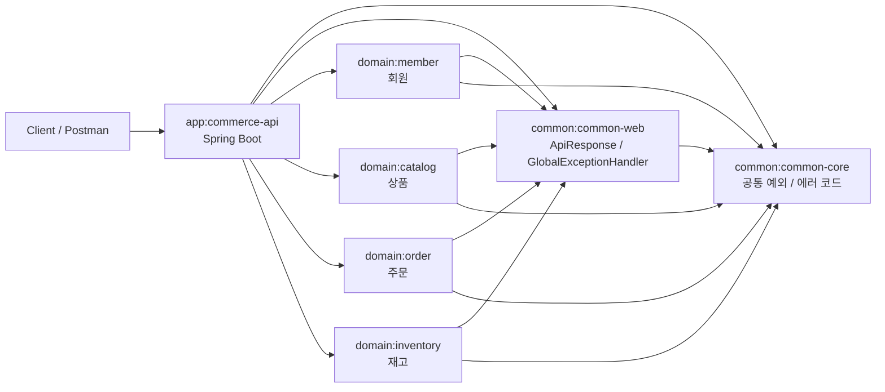
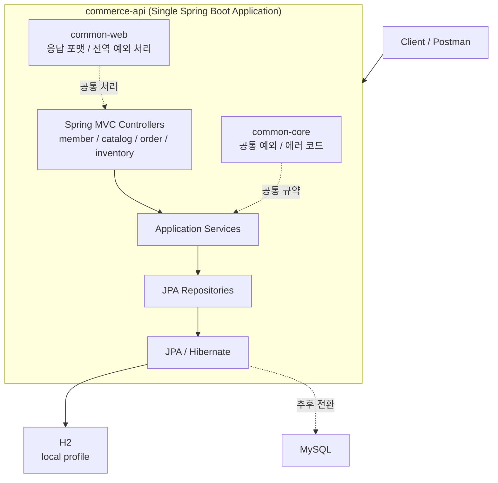
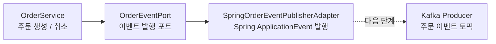

# Toy Commerce Platform

점진적으로 확장하는 학습용 커머스 백엔드 프로젝트입니다.

현재는 마이크로서비스가 아니라, 하나의 Spring Boot 애플리케이션 안에서 도메인 모듈을 분리한 형태의 멀티모듈 모놀리스 구조입니다. 이후 학습 단계에 따라 Redis, Kafka, Spring Cloud Config, Kubernetes, Istio, ELK, Prometheus, Thanos, Grafana, GoCD 등을 순차적으로 붙여 나가는 것을 목표로 합니다.

## 현재 구조

- `app/commerce-api`
  - 단일 실행 Spring Boot 애플리케이션
- `common/common-core`
  - 공통 예외, 에러 코드 같은 기본 규약
- `common/common-web`
  - API 응답 포맷, 전역 예외 처리
- `domain/member`
  - 회원 도메인
- `domain/catalog`
  - 상품 도메인
- `domain/order`
  - 주문 도메인
- `domain/inventory`
  - 재고 도메인

## 아키텍처 다이어그램

### 1. 모듈 구조



### 2. 실행 구조



### 3. 주문 이벤트 흐름



현재 주문 도메인은 Kafka를 직접 알지 않도록 `OrderEventPort`에만 의존합니다. `commerce-api` 애플리케이션이 Spring 이벤트 발행 어댑터를 제공하고, 이후 Kafka 학습 단계에서는 Spring 이벤트를 받아 Kafka 토픽으로 전달하는 어댑터를 추가할 예정입니다.

## 현재 기술 스택

- Java
- Gradle Multi Module
- Spring Boot
- Spring MVC
- Spring Data JPA / Hibernate
- H2
- MySQL
- Redis Cache
- Spring ApplicationEvent

## 확장 방향

현재 코드는 Java 기반으로 구성했고, Gradle 스크립트는 Groovy DSL을 사용합니다. 처음에는 `commerce-api` 하나만 실행하고, 도메인 경계는 모듈로만 분리해 둡니다. 이후 학습 단계에 따라 아래 순서로 확장합니다.

1. MySQL, JPA 기반 CRUD 고도화
2. Redis 캐시와 재고 보조 처리
3. 주문 이벤트 발행 포트와 Spring ApplicationEvent 기반 확장 지점
4. Spring Cloud Config
5. Kafka 이벤트 발행과 구독
6. MongoDB 감사 로그
7. Oracle 레거시 정산 연동
8. Docker, Kubernetes, Istio
9. ELK, Prometheus, Thanos, Grafana
10. GoCD 파이프라인

## 프로필 조합 전략

이 프로젝트의 Spring profile은 하나만 선택하는 실행 모드가 아니라, 상황에 따라 여러 설정 조각을 조합하는 방식으로 사용합니다.

- `local`
  - 로컬 개발 공통 설정입니다.
  - H2 인메모리 DB와 simple cache를 사용합니다.
  - Redis를 사용하지 않는 로컬 실행에서 Redis health check가 Redis 서버를 찾지 않도록 비활성화합니다.
- `mysql`
  - datasource를 MySQL로 교체합니다.
  - 캐시 설정은 바꾸지 않으므로 보통 `local,mysql`처럼 함께 사용합니다.
- `redis`
  - 캐시 구현을 Redis로 교체합니다.
  - `local`에서 꺼 둔 Redis health check를 다시 활성화합니다.

프로필을 직접 조합할 때는 뒤에 적은 프로필이 앞의 설정을 덮어쓸 수 있으므로, 아래처럼 기반 프로필을 먼저 두고 교체 프로필을 뒤에 둡니다.

```powershell
.\gradlew.bat :app:commerce-api:bootRun --args='--spring.profiles.active=local,mysql,redis'
```

자주 쓰는 조합은 profile group으로도 제공합니다.

- `local-mysql` = `local` + `mysql`
- `local-mysql-redis` = `local` + `mysql` + `redis`

## 권장 다음 작업

1. `./gradlew test` 또는 `gradlew.bat test`로 기본 빌드 확인
2. `member`, `catalog`부터 실제 CRUD 확장
3. `local`, `dev`, `prod` 설정 분리
4. MySQL 프로필과 Docker Compose 추가

## 로컬 실행

아무 프로필도 지정하지 않으면 `local` 프로필이 기본으로 적용됩니다. 이 경우 H2와 simple cache를 사용합니다.

```powershell
.\gradlew.bat :app:commerce-api:bootRun
```

Docker Compose로 MySQL을 실행한 뒤 `local,mysql` 조합으로 애플리케이션을 실행할 수 있습니다.

```powershell
docker compose up -d mysql
```

```powershell
.\gradlew.bat :app:commerce-api:bootRun --args='--spring.profiles.active=local,mysql'
```

profile group을 사용하면 아래처럼 실행할 수도 있습니다.

```powershell
.\gradlew.bat :app:commerce-api:bootRun --args='--spring.profiles.active=local-mysql'
```

Redis 캐시까지 함께 확인하고 싶다면 MySQL과 Redis를 함께 실행한 뒤 `local,mysql,redis` 조합을 사용합니다.

```powershell
docker compose up -d mysql redis
```

```powershell
.\gradlew.bat :app:commerce-api:bootRun --args='--spring.profiles.active=local,mysql,redis'
```

또는 profile group으로 실행할 수 있습니다.

```powershell
.\gradlew.bat :app:commerce-api:bootRun --args='--spring.profiles.active=local-mysql-redis'
```

기본 접속 정보는 `.env.example`에 정리되어 있습니다. 개인 환경에서 값을 바꾸고 싶다면 `.env` 파일을 만들어 Docker Compose 환경 변수로 사용하면 됩니다.
